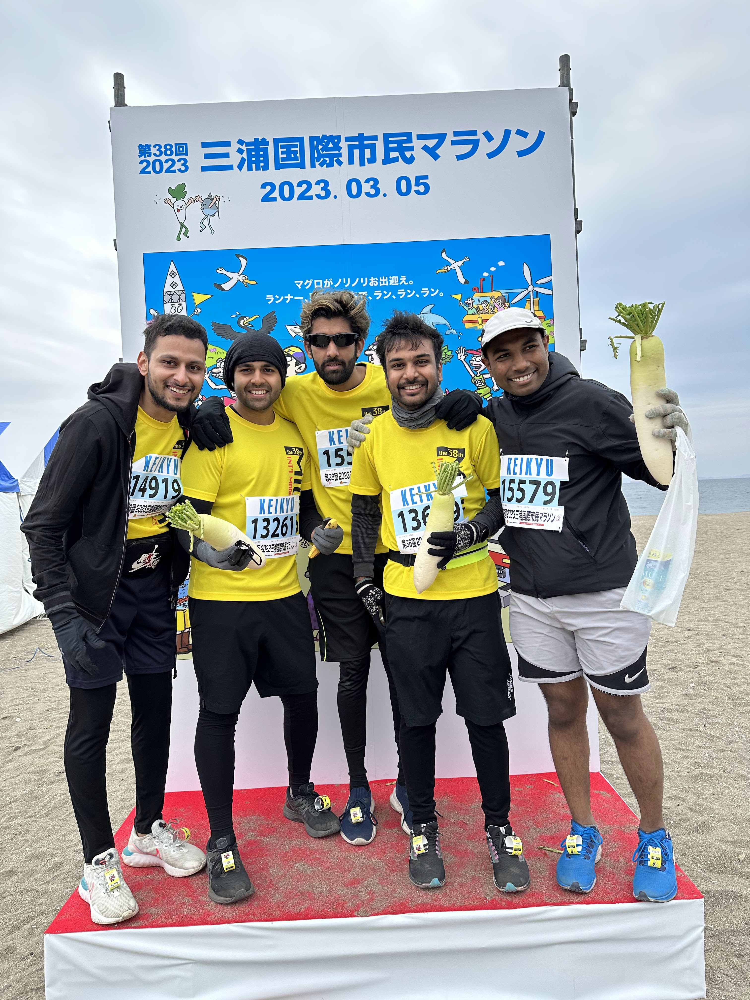

Around Nov22 I got interested in running marathon when I went to visit a friend of mine who was participating in a half marathon event in Chiba, Japan. It was my first experience witnessing a marathon event and the joy in the face of runners was special. Those tired cheerful faces of both young and old people. 

Soon, I started my running journey soon after the event and I enrolled for my first marathon in early Mar23. I managed to convince some of my friends to participate as well. 

### Tokyo 30K Fall Tournament in Horikiri Waterside Park Arakawa Riverbed - Katsushika Ward - 07th Oct 2023

- Ohh god, ngl it was tough but conquered 30kms.
- Followed a group aspiring to finish the Marathon in 4.5 hours. Was challenging but followed them for 20kms at 6m20s average, which was extraordinary.
- Completed in 3hrs 24 mins.

### Marathon Festival in Showa Kinen Park - 17th June 2023
<!--  -->
- Second ever Half Marathon!
- Completion time 2:19:35
- Extremely sunny and humid conditions made it tough.
- Location was a park and we made 4 rounds around the park.

### Miura International Marathon - 5th March 2023
<!--  -->
- My first Half Marathon!!!
- Total time taken was 2:16:39
- Weather was cool and windy.
- Experience was awesome running along the beach with scenic views of vast sea and green fields.
- Yes, we received the raddish as the prize lol.

